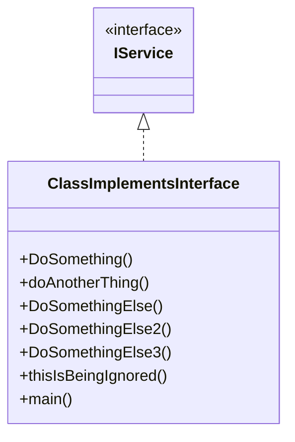

# Documentation for `ClassImplementsInterface.cs`

## Namespace
```csharp
namespace src.MyTestProject;
```

## Classes and Interfaces

### Interface `IService`
- The code snippet references an interface named `IService`.
- The interface itself is not defined in the provided file, but the class `ClassImplementsInterface` implements it.
- Since `IService` is not shown, we infer that it declares at least some of the methods that `ClassImplementsInterface` implements, such as `DoSomething()`, `DoSomethingElse()`, etc.

### Class `ClassImplementsInterface`
- Implements the interface `IService`.
- Provides concrete implementations for multiple methods.
  
#### Implemented Methods
- `DoSomething()`
- `doAnotherThing()`
- `DoSomethingElse()`
- `DoSomethingElse2()`
- `DoSomethingElse3()`
- `thisIsBeingIgnored()` (likely not part of `IService`, since it is labelled as ignored)
- `main()`

#### Relationships:


- `ClassImplementsInterface` **implements** `IService`.
- No inheritance from other classes.
- The `main()` method inside this class calls four other methods in this class, implying an internal association (method calls within the same class).

#### Method Role Summary:
| Method                  | Likely `IService` Method | Description                      |
|-------------------------|--------------------------|--------------------------------|
| `DoSomething()`         | Yes                      | Performs a generic action       |
| `doAnotherThing()`      | Possibly                 | Another action, similar to above|
| `DoSomethingElse()`     | Yes                      | Another interface method        |
| `DoSomethingElse2()`    | Yes                      | Another variant of action       |
| `DoSomethingElse3()`    | Possibly                 | Yet another variant action      |
| `thisIsBeingIgnored()`  | No                       | Probably a helper or internal   |
| `main()`                | No                       | Calls other class methods       |

## Summary
- `ClassImplementsInterface` implements the `IService` interface.
- It defines all required methods and some additional helper methods.
- The class does **not** extend any other class.
- The methods are associated internally via calls in `main()`.